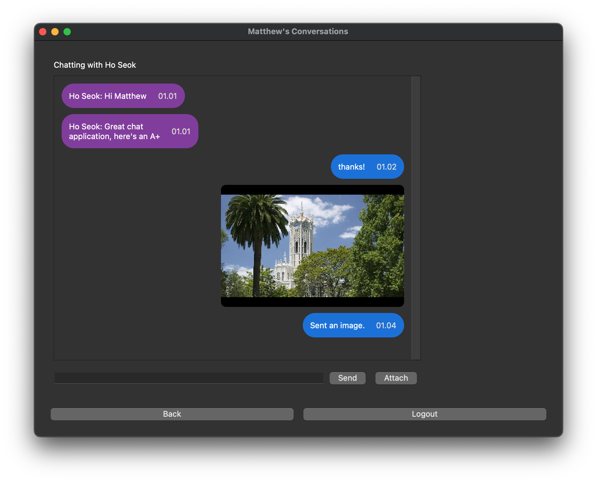

# Encrypted Chat Application
An encrypted chat application created for SOFTENG 364 - Networks and Security
at the University of Auckland.

The application is built using Python Sockets and PyQt5.



## Running
The application must be run from the root directory.

By default it uses:
 - Address: `localhost`
 - Port: `12000`

There are two parts, the server (`server.py`) and the (`app.py`).

```bash
# Run Server
python3 src/server.py

# Run Client (GUI)
python3 src/app.py
```

**IMPORTANT:** In order for the SSL certificates to be detected, both
the server and client must be run from the root directory.

Additionally, a virtual environment is included (`venv`) but note that it
expects PyQt to be provided by the system's site-packages. It can be run with
`source .\venv\bin\activate`.

## How to generate certificate
The certificate (named `cert.pem`) is generated as follows. Please
refer to [this answer][pem_cert] on Stack Overflow for the original
instructions.

The following commands should be run inside the `/certs` directory
so the certificate can be found by the server. Alternatively you may
adjust the file path inside `config.py`.

Firstly, generate the request (.csr) and private (.key) key:

```bash
openssl req -new -newkey rsa:4096 -nodes -keyout cert.key -out cert.csr
```

Then generate a certificate (.pem) and self-sign with our private key:

```bash
openssl x509 -req -sha256 -days 365 -in cert.csr -signkey cert.key -out cert.pem
```

[pem_cert]: [https://serverfault.com/questions/889581/how-to-generate-a-pem-certificate-in-an-easy-way-for-testing]